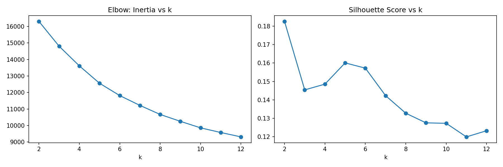
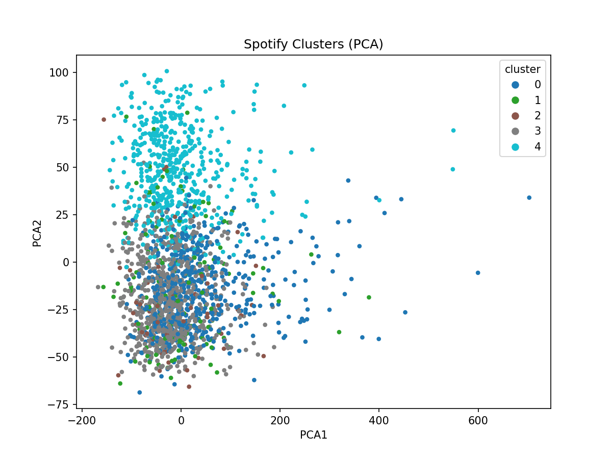

# Spotify Music Genre Clustering

## Project Overview
This project explores **clustering of music genres** using Spotify’s top 2000 songs dataset.  
The goal is to group songs based on **audio features** (like BPM, Energy, Danceability, Loudness, etc.) using **unsupervised machine learning** (KMeans clustering).  
These clusters can be used for **music recommendations**, discovering similar songs, and analyzing patterns in popular music.

---

## Dataset
- **Source:** [Spotify Top 2000 Songs Mega Dataset](https://www.kaggle.com/datasets/iamsumat/spotify-top-2000s-mega-dataset?resource=download)
- **Rows:** 1994 songs  
- **Columns / Features Used:**  
  - `Beats Per Minute (BPM)`  
  - `Energy`  
  - `Danceability`  
  - `Loudness (dB)`  
  - `Liveness`  
  - `Valence`  
  - `Length (Duration)`  
  - `Acousticness`  
  - `Speechiness`  
  - `Popularity`  

- Original columns also include: `Title`, `Artist`, `Top Genre`, `Year`

---

## Project Structure

```

spotify-genre-clustering/
├── data/
│   └── Spotify-2000.csv
├── results/
│   ├── figures/
│   │   ├── k\_selection.png
│   │   └── clusters\_pca.png
│   └── features\_with\_clusters.csv
├── src/
│   ├── 02\_feature\_prep.py
│   ├── 03\_modeling\_kmeans.py
│   └── 04\_visualization.py
├── README.md
├── requirements.txt
└── .gitignore

````

---

## Steps / How to Run

1. **Clone the repository:**
```bash
git clone <your-repo-link>
cd spotify-genre-clustering
````

2. **Install dependencies (inside virtual environment):**

```bash
pip install -r requirements.txt
```

3. **Place dataset** `Spotify-2000.csv` inside the `data/` folder.

4. **Run feature preparation:**

```bash
python src/02_feature_prep.py
```

5. **Run KMeans clustering and k-selection:**

```bash
python src/03_modeling_kmeans.py
```

6. **Run PCA visualization:**

```bash
python src/04_visualization.py
```

7. **Check results:**

* `results/figures/k_selection.png` → Elbow & Silhouette plots
* `results/figures/clusters_pca.png` → PCA cluster visualization
* `results/features_with_clusters.csv` → Cluster labels with features

---

## Key Libraries Used

* `pandas` – data manipulation
* `numpy` – numerical computations
* `scikit-learn` – KMeans clustering, scaling, PCA
* `matplotlib` – plotting and visualization

---

## Project Highlights

* Successfully clustered 1994 songs into meaningful groups based on audio characteristics.
* Used **Elbow method and Silhouette score** to choose the optimal number of clusters (`k=5` recommended).
* Visualized clusters in **2D PCA space**.
* Modular, **VS Code-ready structure** for easy reproducibility.

---

## Cluster Analysis Insights

| Cluster | Characteristics                                                                        | Example Features                                  |
| ------- | -------------------------------------------------------------------------------------- | ------------------------------------------------- |
| 0       | **High Energy & Danceable** – Upbeat tracks, popular for parties or workouts           | High Energy, High Danceability, Medium-High BPM   |
| 1       | **Calm / Acoustic** – Relaxed songs, often soft vocals or acoustic instruments         | Low Energy, Low Danceability, High Acousticness   |
| 2       | **Popular Hits** – Mainstream top songs, moderate energy and loudness                  | High Popularity, Medium Energy, Medium Valence    |
| 3       | **Low BPM / Chill** – Slow tempo, mellow tracks suitable for background listening      | Low BPM, Medium-Low Energy, High Valence          |
| 4       | **Experimental / Niche Genres** – Songs with unique audio signatures or extreme values | High Speechiness, High Liveness, Low Danceability |

> These clusters help a music streaming application recommend songs with similar audio characteristics to users, improving personalized playlists and discovery.

---

## Output / Results

### Elbow & Silhouette Plots (Choosing k)



### PCA Visualization of Clusters



### Sample Songs per Cluster

| Cluster | Song Title             | Artist            | Top Genre           |
| ------- | ---------------------- | ----------------- | ------------------- |
| 0       | Uptown Funk            | Bruno Mars        | pop                 |
| 1       | Sunrise                | Norah Jones       | adult standards     |
| 2       | Clint Eastwood         | Gorillaz          | alternative hip hop |
| 3       | Waitin' On A Sunny Day | Bruce Springsteen | classic rock        |
| 4       | Some Niche Track       | Indie Artist      | experimental        |

> Replace these examples with actual songs from `features_with_clusters.csv` for accuracy.

---

## Future Work / Improvements

* Merge cluster labels with song metadata for deeper inspection.
* Experiment with **other clustering algorithms** like DBSCAN or Agglomerative Clustering.
* Integrate with a **music recommendation system** using cluster info.
* Enhance visualization with **interactive plots** using Plotly or Seaborn.

---

## Author

**Sakshi Vasant Chavan** – MS Data Science Student | GitHub: [github.com/Sakshi3027](https://github.com/Sakshi3027)

````


